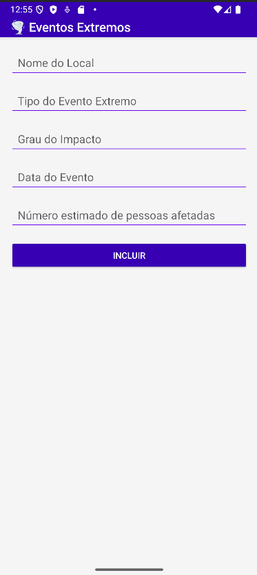
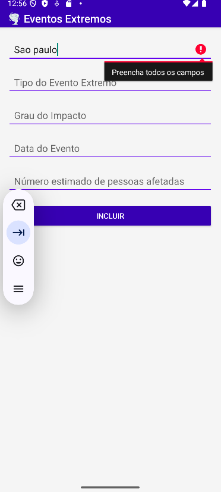
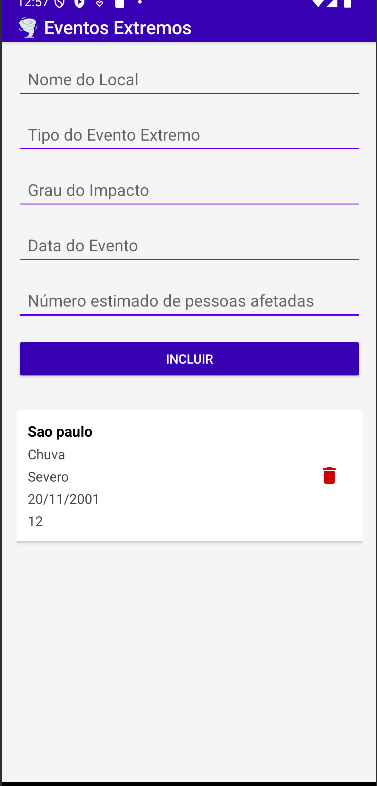
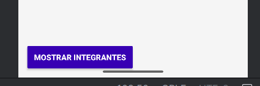
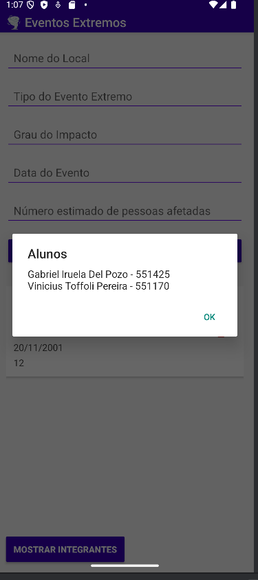

##  Telas em Funcionamentos 

Primeira tela: ao entrar no aplicativo, mostrando a interface de UI 

Segunda tela: mostrando os campos e suas requisicoes de preenchimento de todos os campos

Terceira tela: mostrando o funcionamento de cadastro do evento

Quarte tela: Mostrando o botão dos integrantes da equipe 

Quinta tela: Mostrando os integrantes com um Pop Up na tela

